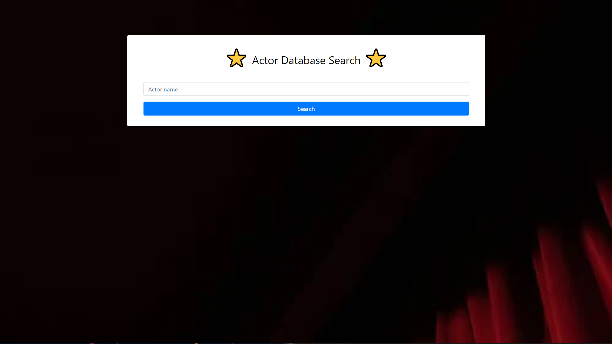
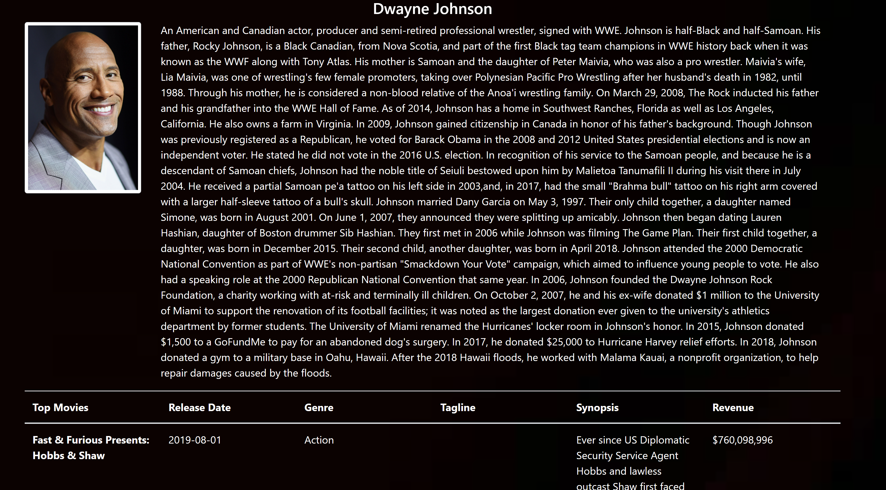

# Actor database 

# Description -

With this project, we were allowed creative freedom to collaborativly agree on a functional and practical website to design from scartch. 

The following website allows it's user to search an actor/actress name and upon clicking the search button, it will take the user to a different page where the actor/actress's name, bio, and a photo of them will populate within the header of the page. 

Below the header, their top five movies will be displayed followed by their release date, genre, tagline, synopsis, and it's revenue. 

Below the movie details, the actor/actress's most recent tweet will be displayed alongisde a list of articles that correlate with them.

# Requirements -

Per the instructions, we were required to implement and include certain features wtihin our code and website.

The website's home page requires the user to search a actor/actress name, then the website will accept the input, stores it in local storage, and redirect the user to another page where all the information will be populated. 

    * Be interactive (i.e., accept and respond to user input)

    * Use client-side storage to store persistent data.

Three APIs were implemented within the website. The MovieDB, Twitter, and Media Stack. 

The movieDB took used the local storage from the search input from the user and populated the actor/actress's photo, name, bio, top five movies, and those movie's descriptive features.

The movieDB also supplied the twitter ID of the actor/actress which was then implemented with the twitter API to pull their latest tweet and have it displayed.

Media stack was used to pull articles that pretain to the actor/actress. These articles are formatted as hyperlinks which display the article's title as the link. When clicked, it will redirect the user to the article.

    * Use at least two [server-side APIs](https://coding-boot-camp.github.io/full-stack/apis/api-resources)

The following requirements have been included and met through our coding functionality and formatting. 

    * Be responsive.

    * Have a polished UI.

    * Have a clean repository that meets quality coding standards (file structure, naming conventions, follows best practices for class/id naming conventions, indentation, quality comments, etc.).

    * Does not use alerts, confirms, or prompts (use modals).

    * Have a quality README (with unique name, description, technologies used, screenshot, and link to deployed application).

# Home Page

# Result Page
